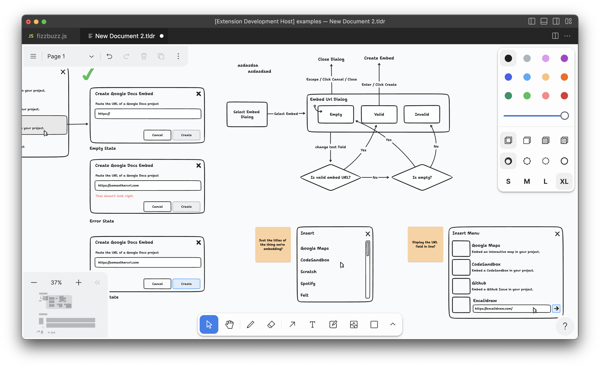

# Simple tldraw Project

This is a React project that integrates the [tldraw](https://www.tldraw.dev/) drawing library. The application allows users to switch between light and dark modes for the drawing interface.


## Features

- **tldraw Integration**: A powerful, customizable drawing component.
- **Theme Toggle**: Switch between light and dark modes.
- **Persistent Theme**: The chosen theme is saved and applied on subsequent visits.

## Getting Started

Follow these instructions to get a copy of the project up and running on your local machine.

### Prerequisites

- Node.js and npm (or yarn)

### Installation

1. Clone the repository:

```bash
git clone https://github.com/yourusername/my-tldraw-app.git
cd my-tldraw-app
```

2. Install dependencies:

```
npm install
# or
yarn install
```

3.Start the development server:

```
npm start
# or
yarn start
```
